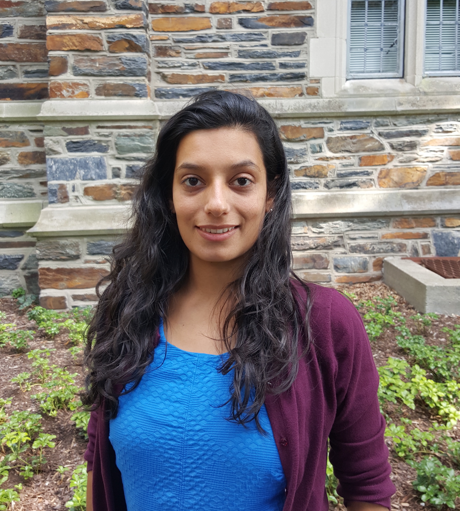

<link rel="stylesheet" href="styles.css" type="text/css">

I am a social scientist specialized in social psychology and social networks. My work combines network analysis and computational techniques to investigate how people’s multiple identities and beliefs are organized. 

I am currently a Ph.D. Candidate in the Department of Sociology at Duke University and I am affiliated with Duke Network Analysis Center. 

My full CV is available [here](files/CV.pdf).
